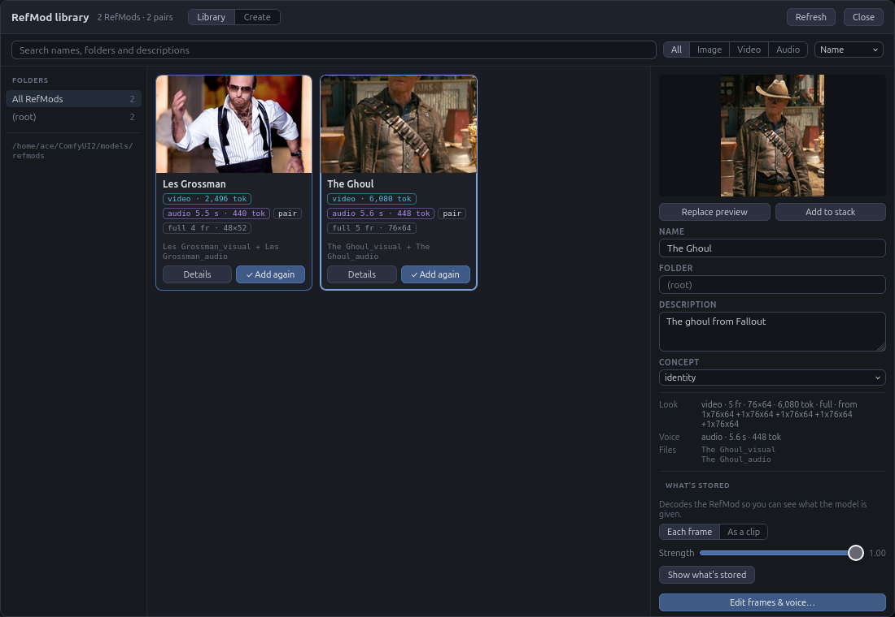

# ComfyUI Fantastic H3 Prompt Builder

  

Guided prompt writing and reference-media handling for the open-weight
**MiniMax H3** video model in ComfyUI.

H3 doesn't want a casual sentence — it wants a structured prompt with named
sections, shot timings, speaker IDs, and tags pointing at your reference media.
MiniMax publishes a written guide for that format, and normally a separate
rewriting model (`H3-Context-IR`) turns your idea into it. That rewriter wasn't
open-sourced. This node pack is the hand-driven replacement: fillable templates
for every mode, live checking against the guide's rules, and a media loader that
keeps your reference tags straight.


*Media Loader → Prompt Builder → MiniMax H3 Reference to Video*


*Media Loader → Prompt Builder → MiniMax H3 Image to Video*


*Media Loader → Reference Splitter → processor. For use without the Prompt
Builder, managing reference media only.*


*Media is displayed while you work. Hover over for previews. Clicking media
automatically adds the tag (like `<Picture 1>`) into the active text field for
you.*

Picture thumbnails in the Media Loader carry their pixel size and aspect ratio
in the corner, repeated in the larger preview when you click one. The ratio is
named from the same list the resolution selectors use (16:9, 4:3, 9:16, 21:9
and so on), with `≈` when a reference only comes close — so you can see at a
glance which preset matches it. Hover the thumbnail for the exact figures.


*Trim and crop clips on the fly without touching the original files, and pull
any frame straight out of a video into your picture references.*



*Now supports creating, editing, organizing, and tagging
[RefMods](REFMODS.md).*

---

## What's new in 1.8.2

- **Masking in RefMod Create.** Crop each picture and clip to its subject
  and blur the background, so props and backgrounds don't bleed into the
  RefMod. **Find and Mask All** in **Batch Masking** finds the subject in
  every source with SAM 3.1, from a word (starting as `person`); **Crop to
  subject** crops around it, grown to the stack's shape, and **Blur
  background** blurs the rest before it's encoded. **Crop and mask…** on a
  row (**Trim, crop and mask…** on a clip) works on one picture: its own
  word, **▶ Auto mask**, **◉ Dots**, and a **✎ Brush** that paints into the
  mask or erases from it (on a clip, every frame), with settings that
  follow Batch Masking until you change them there. In edit mode, a Full
  RefMod's stored frames can be blurred too (**Mask…** on a frame), with
  **Background kept** setting how much stays. The masks are temporary; the
  RefMod records what was done, shown as a **bg blurred** badge. See
  [Crop to the subject](REFMODS.md#crop-to-the-subject-and-blur-the-background).
- **Fantastic H3 Reference Map.** A new node that gives the Text Encode's
  `reference_map` without encoding: every label in the order the model
  reads them. It shows the map as you edit the graph, before anything is
  queued, with **⧉ Copy** for pasting into an LLM, and outputs it for an
  LLM node.
- **Reference order on the Text Encode.** The node lists its references in
  the order the model reads them, kept up to date as you edit the graph.
  **▦ Thumbnails…** shows them all as small previews.
- **Fixes.** A RefMod renamed in the library keeps its new name in the
  Stack's `labels` and the `reference_map`. RefMod names must be unique:
  Create, rename and Save as a copy refuse a name that's taken. **⬇ Write
  copy** in the picture editor shows its progress and errors. The guide's
  contents jump to the section clicked, dropping a picture on the Create
  tab lights the drop area reliably, and the stale "Audio can't be sent
  alone" warning is gone.

## What's new in 1.8.1

- **Custom size.** The trim and crop editor's size menu has **custom…**: type
  any long edge, applied with Apply like the presets.
- **stack_pictures: up to N.** "up to 8" is now **up to N**, and the new
  **stack_pictures_n** under it sets N (8 by default). A workflow saved with
  "up to 8" needs it picked again.
- **Edit bundles as copies.** RefMod bundles from ComfyUI-MiniMaxH3Mod 0.2.6+
  open in **Edit frames & voice**. The result is saved as a copy in standalone
  files and the bundle is left as it is, so saving a copy with no changes
  splits a bundle into standalone files.
- **Library size.** The RefMod library has its own **⤡ Size** for its window
  and text size.
- **Stack labels without the builder.** The RefMod Stack's cards number
  RefMods after the Media Loader's media, as the Text Encode will, with or
  without the Prompt Builder in between.
- **Mask preview fixes.** The overlay redraws when you change the size or the
  crop, and no longer draws grow and the regenerated cells too large on a
  cropped clip. The edit itself was always right.

## What's new in 1.8.0

- **Masked video editing.** Mark part of a clip and only that area is
  regenerated; the rest stays as filmed. Right-click a video on the Media
  Loader and choose **◐ Mask for editing…**. The mask is built from layers,
  new ones on top, each adding to or cutting from those below: **Auto Mask**
  (SAM 3.1, from dots and a name), keyframed **ellipses, rectangles and
  polygons**, and **brush** strokes. Grow, feather, invert and crop to mask
  shape it. The RefMod Text Encode builds the edit, and the new **Fantastic
  H3 Edit Composite** pastes exactly the regenerated area back into your
  original frames. It needs the SAM 3.1 checkpoint; see
  [Editing a clip with a mask](#editing-a-clip-with-a-mask).
- **A faster RefMod Text Encode.** RefMods now keep the pictures the text
  encoder is shown inside their file, so it no longer decodes them on every
  run. Older ones are decoded once and cached, and the library's **Store
  encoder frames** adds them to old files for good.
- **stack_pictures** (experimental) on the Text Encode sets how many of a
  RefMod's pictures the encoder sees: every 4th (the default, about what it
  saw before), up to 8, or all. More may help identity and bleeding between
  RefMods, but costs memory and generation time.
- **Trim editor.** Zoom the timeline (−/+, the slider, the - and = keys, or
  scroll), see how far the playhead is past the first kept frame, and stop
  losing work to a stray click or Esc: with unsaved changes it asks first.
  Ctrl+Z inside it no longer undoes the graph. Loader rows show each clip's
  length beside ✂, and video cards show their aspect ratio as sent.
- **Right-click selected text** in any builder field for Copy, Cut, Paste
  and Remove, alongside Save selection as phrase.
- **Clean up…** in the Media Loader deletes mask files nothing uses and
  saved latents, keeps masks used by saved media sets and drafts, and
  offers itself once unused masks pass 500 MB (set the size in its ⚙ menu).
- **voice_description_at_label** on the Text Encode also writes each voice
  RefMod's saved description right after its `<Audio n>:` label.
- New RefMods default to a **768 px** short edge (was 1024).
- The 📖 Guide adds **Part E** on masked editing.

## What's new in 1.7.4

- **Compressed RefMods no longer squash faces.** A photo of a different
  shape from the first one was squeezed to fit in Compressed mode; it is now
  trimmed to the first one's shape, as Full always was, and the Create tab's
  previews show the trim. If Compressed seemed to lose likeness on
  characters, try it again.
- **The RefMod library keeps unfinished work.** Close it mid-way (Close,
  Escape or a click outside) and the Create tab's sources, names,
  descriptions and any edit in progress are kept. Browse library…, Create…
  or an empty slot brings you back where you left off; Start fresh clears it.
- **Retained attributes.** A new RefMod field for the small details the
  model should keep — a tattoo, a scar. Set it on the Create tab, in edit
  mode or in the details panel; Draft from RefMods adds it to the end of the
  subject's retention_analysis note.
- **Stack cards.** Click a card's thumbnail or name to open the library on
  that RefMod's details. Drag to reorder works again, from the handle,
  thumbnail or name, and can drop onto an empty slot to go last. Create tab
  source rows are numbered, like Image 3/7.
- **Clearer refusals.** A refused request prints one line to the ComfyUI
  console naming the failed check (never the token). "Missing or stale
  session token" after a fresh retry now explains that a proxy, tunnel or
  another extension may be removing the `X-MiniMaxH3-Token` header. The
  origin check also refuses same-site requests, as SECURITY.md described.
- Release notes have moved to [CHANGELOG.md](CHANGELOG.md); the README keeps
  the recent ones.

## What's new in 1.7.3

- **A new RefMod Stack node.** Twelve fixed slots that never resize the
  node, a slider per channel labelled with its tag, a position badge on
  each card, and ⤢ Size for node and text scale. Colours match the Media
  Loader.
- **RefMod presets.** Save a stack with its weights and load it into any
  stack node. A prompt in the library can be linked to one.
- **Chain stacks.** Wire stacks together and each one shows where it sits
  in the chain and which labels come from the stacks before it.
- **Right-click a tag** to swap in another picture, subject, name or
  speaker, swap two of them, or remove it — in one place, one field, or
  everywhere.
- **Tab to fill names.** Start typing `!cas` and press Tab for
  `!castle_with_moat`.

## What's new in 1.7.2

- **Name your subjects.** Each `<Subject N>` line has a name box, and
  `!Ann` works as shorthand anywhere in the prompt.
- **RefMods remember who they are.** Save a subject name, how they look and
  how they sound with a RefMod. Draft from RefMods writes all of it into
  your prompt.
- **Voices you can describe.** Voice lines get a voice box, and the speaker
  buttons can insert a line that names the voice, like "in the low, husky
  voice referenced from <Audio 1>".
- Draft from RefMods can start over or fill in missing names and voices
  when everything is already drafted.
- The built-in 📖 Guide adds parts on using the Prompt Builder and RefMods.
- The Quick start now builds the workflow before you write the prompt.

## What's new in 1.7.1

- RefMods made from a **video clip** now hold real motion. Create and Edit
  take the first frames of the clip (after your trim) on H3's own frame
  grid — 22 frames store 7, 39 store 12, 56 store 17 — instead of evenly
  spaced picks that stored only 2 frames. **Clip frames** defaults to 22
  and shows what you'll get as you change it.
- Deleting a RefMod now closes its details panel.
- Single-file RefMod bundles saved by ComfyUI-MiniMaxH3Mod 0.2.6 show up
  in the library and can be used and inspected (not edited) here.

Older releases are in the [changelog](CHANGELOG.md).

---

## Contents

- [What you get](#what-you-get)
- [Requirements](#requirements)
- [Install](#install)
- [Quick start](#quick-start)
- [Writing a prompt](#writing-a-prompt)
- [Prompt library](#prompt-library)
- [Draft mode](#draft-mode)
- [Reference mode](#reference-mode)
- [FAQ: wiring reference media](#faq-wiring-reference-media)
- [RefMods](#refmods) (step-by-step: [RefMods how-to guide](REFMODS.md))
- [Editing a clip with a mask](#editing-a-clip-with-a-mask)
- [Dated output folders](#dated-output-folders)
- [Troubleshooting](#troubleshooting)
- [Credits](#credits)
- [License](#license)
- [Changelog](CHANGELOG.md) — every release, back to 1.6.0

## What you get

Six nodes, all under **conditioning → video_models**:

| Node | What it's for |
|---|---|
| **Fantastic H3 Prompt Builder** | The main one. An editor with fillable fields for every prompt mode, checks your work as you type, and outputs the finished prompt. |
| **Fantastic H3 Media Loader** | Drag-and-drop your reference images, videos, and audio. Shows exactly which tag each one will get. |
| **Fantastic H3 Input Media Loader** | Select existing media from ComfyUI's `input` folder without uploading or copying it. Includes image/video thumbnails and the same reference controls. |
| **Fantastic H3 Reference Splitter** | Optional. Fans media out into individual slots when you want it to skip the Prompt Builder. |
| **Fantastic H3 Filename Prefix** | Optional. Builds a save prefix with the date already filled in, for dated output folders. |
| **Fantastic H3 Edit Composite** | For masked edits. Pastes the regenerated area into the original frames, so the rest is the source untouched. See [Editing a clip with a mask](#editing-a-clip-with-a-mask). |
| **Fantastic H3 Video Edit Latent** | Optional. Builds a masked-edit latent from frames and a mask made elsewhere. |

Highlights:

- **Templates for all five modes** — text-to-video, first frame, first+last
  frame, last frame, and full reference mode.
- **Click-to-insert tags.** Your reference media appears as thumbnails; click
  one to drop `<Picture 2>` into your text. No typing tags by hand.
- **Live checking.** Shot numbering, cut times, dialogue formatting, references
  you connected but never mentioned — flagged while you write, not after a
  failed render.
- **The official guide is built in.** A 📖 button opens the full guide in a new tab — searchable, linkable, and readable on a phone.
- **Your work isn't lost by a stray click.** Closing with unsaved changes asks
  first — **Save to node**, **Discard**, or **Keep editing**. Only *Save to
  node* changes what the node sends. If you'd rather work the other way round,
  ⚙ → *Save to node when closing* makes ✕, Escape and clicking outside hand
  your changes to the node instead of asking; Cancel still discards, and a
  draft is never written to the node by closing. The ⚙ menu can also turn off
  click-outside-to-close, or the warning itself.
- **Reference tags read as chips** in the text, colour-coded by kind (⚙ has a
  toggle for plain text fields, which keeps the hover previews), with the
  thumbnail on hover — no side panel opening and shifting the layout. Hovering
  a `<Subject N>` shows the first picture its definition cites, the media it
  references, its speaker ID, and any `<Audio N>` attached to it — including
  voice references declared the other way round, in the audio's own line. Tags
  with nothing behind them show red as you type.
- **A dialogue row** with a language picker and one button per speaker already
  in the prompt, plus the next unused ID — and a voiceover toggle that writes
  the guide's exact phrasing including the lips-closed clause.
- **Cut markers are chipped too** — `[Shot 2] at 00:03.000` reads as one unit,
  in a neutral slate, so the structure of a multi-shot prompt is scannable.
- **Spoken lines are shaded** — `<d>…</d>` blocks get a blue band matching the
  speaker chips, with the markers dimmed and the language tag picked out, so you can see at a glance
  what the model will actually say and catch delivery notes that drifted
  inside the tags. Speaker IDs like `(S1)` are chipped too.
- **Drag-and-drop media** with previews, playback, and reorderable slots.
- **Non-destructive trim and crop** — a popout editor sends just a slice of a
  clip (like its last 3 seconds), or just a region of the frame, without
  touching the file.
- **A prompt library** — save prompts with categories and favourites, then
  search and reload them.
- **Draft mode** — park the prompt that's queued and start the next one on a
  disk-backed scratchpad, with its own reference set, that can't be executed
  until you commit it.
- **The media loader opens inside the editor** — no hunting for the node on
  the canvas to add a reference mid-sentence.
- **Media presets** so you can reload a set of references in one click.
- **Unload media** clears the node in one go (after a confirmation) without
  deleting the underlying files, so presets pointing at them still work.
- **Size control** — ⤢ Size sets the node's scale (100–300%) and its text size
  (100–200%) independently, by slider or by typing the number. Changes apply when you press **Apply**, not while you drag, because
  resizing the node would pull the slider out from under the pointer. Both are remembered for you
  rather than for the workflow, so a node dropped into a new graph starts at
  the size you actually work at. The prompt editor has the same two sliders in
  its ⚙ menu, which is what you want on a 4K monitor.
- **Detail control for reference video** — decode big clips at a smaller size
  so a long 4K reference doesn't eat gigabytes of RAM.

---

## Requirements

- **ComfyUI 0.30.0 or newer** — this is when H3 support landed.
- **The MiniMax H3 models.** Use the `fl2va` checkpoint for text and keyframe
  work, `ref2va` for reference mode. ComfyUI's own H3 templates will set you up.
- **PyAV** — used for video and audio decoding. ComfyUI itself requires PyAV,
  so every working install already has it; the node checks at startup and
  tells you if videos are unavailable rather than failing when you hit queue.
  Since 1.6.2 the pack never shells out to ffmpeg — decoding is all in-process
  through PyAV.

---

## Install

**Via git**

```bash
cd ComfyUI/custom_nodes
git clone https://github.com/Adudeguyman/ComfyUI-Fantastic-MiniMaxH3-PromptBuilder
```

**Via ComfyUI Manager** — search for "Fantastic H3 Prompt Builder" and install.

**Manually** — download the ZIP and extract into `ComfyUI/custom_nodes/` so you
end up with `ComfyUI/custom_nodes/ComfyUI-Fantastic-MiniMaxH3-PromptBuilder/`.

Then **restart ComfyUI completely** — not just a browser refresh. Nodes are only
registered at startup.

To confirm it worked, search the node menu for "MiniMax H3". All three nodes
above should be listed.

---

## Quick start

This is the same for every mode. Build the workflow first, then write the
prompt into it:

1. Start from ComfyUI's own MiniMax H3 template for your mode. It already has
   the loaders, sampler, decode and save nodes.
2. Add a **Fantastic H3 Prompt Builder**. Connect its `prompt` output to the
   `prompt` input on the template's H3 node:
   - **MiniMax H3 Image to Video** for T2VA, I2VA, FL2VA, and L2VA
   - **MiniMax H3 Reference to Video** for reference mode

   If `prompt` shows as a widget rather than an input, right-click it and choose
   *Convert widget to input*.
3. Wire up whatever your mode needs:
   - **T2VA** — nothing else; the prompt is the whole input.
   - **I2VA / FL2VA / L2VA** — load your keyframe images with either ComfyUI's
     own **Load Image** nodes or this pack's **Media Loader**, then connect them
     to **Image to Video** like so:
     - **I2VA** — your image → `first_frame`
     - **FL2VA** — first image → `first_frame`, second image → `last_frame`
     - **L2VA** — your image → `last_frame`

     With **Load Image** nodes you have a choice: wire them straight into the
     H3 node, or route them through the Prompt Builder first — into its
     `picture_1` input and back out of the matching output. You can also do
     both, by splitting the connection so the same image reaches the H3 node and
     the builder. Routing through the builder is what gives you previews while
     you write.

     The **Media Loader** does the same job with less wiring: drop your images
     on it, run its single `references` output into the Prompt Builder, and take
     the frames from the builder's `picture_1` and `picture_2` outputs.
   - **Reference mode** — see [Reference mode](#reference-mode) below.
4. Set `width`, `height`, and `length` on the H3 node.
5. Click **Edit prompt…** on the builder, pick the same mode along the top, and
   fill in the fields. The finished prompt builds live in the right-hand panel,
   and your wired media shows up as thumbnails. For first/last-frame modes the
   editor shows the exact frame count to use — H3 only accepts certain values,
   and the editor already rounds to a valid one — so match `length` to it.
6. Click **Save to node**, then queue it.

The rest of the workflow — loaders, samplers, VAE decode, save — is unchanged
from ComfyUI's built-in MiniMax H3 templates. This pack only replaces how the
prompt gets written.

---

## Writing a prompt

Click **Edit prompt…** to open the editor, then pick a mode along the top:

| Mode | You give it | Good for |
|---|---|---|
| **T2VA** | Just text | Building a scene from scratch |
| **I2VA** | A first frame | Animating forward from an image |
| **FL2VA** | First and last frames | Getting from A to B |
| **L2VA** | A last frame | Working backwards to a known ending |
| **Reference** | Any mix of images, video, audio | Locking a character, style, voice, or motion |

The editor fills in the fixed boilerplate — instruction lines, timing values,
section headers — so you write the actual description and it assembles a
correctly formatted prompt underneath. The right-hand panel shows the finished
prompt live as you type.

**Things the toolbar does for you:** inserts numbered shots with correctly
formatted cut times, writes camera moves as proper sentences, wraps dialogue
with the right language tags and speaker IDs, and drops in reference tags.

**Right-click a tag** — a `<Picture 2>`, `<Subject 1>`, `!Ann` or `(S1)` — to put
another of the same kind in its place, swap the two, or remove it. **This
tag**, **Field** and **Everywhere** set how far the change reaches, and each
shows how many copies it would change. Tags nothing in the prompt cites yet
are listed first, marked *unused*. Removing a subject or media tag
everywhere also deletes the definition line and retention row for it.
Speaker IDs work inside group tags too: swapping S1 and S2 everywhere turns
`(S1,S2)` into `(S2,S1)`, and the next unused ID is offered as *new*. A
line inserted with a speaker button's voice option moves as a whole: give it
another speaker and its name and voice clause become theirs, and removing
the ID drops the voice clause but keeps the name. Swapping IDs everywhere
only renumbers, so every line keeps its speaker.
This tag and Field can be undone with Ctrl+Z.

**Right-click selected text** in any field for **Copy**, **Cut**, **Paste**
and **Remove**, or to save it as a phrase. Ctrl+Z undoes Cut, Paste and Remove.

**Things it checks:** shots numbered in order, cut times increasing and inside
your video's length, `[Shot 1]` not carrying a timestamp, dialogue tags balanced
and labelled, references you connected but never mentioned, and — in reference
mode — every subject having a matching retention entry.

Amber warnings are advisory and the prompt saves regardless. Red errors are the
ones worth fixing before you render.

**Clear** in the header empties every field and starts a new prompt in the same
mode. It asks first, and the node keeps whatever prompt it already has until you
save — so clearing is only permanent once you press **Save to node**.


*I2VA layout — only the input Picture 1 can be used in I2VA mode. Other media is
disabled. You can rearrange which image is used as Picture 1 on the Media Loader
node: click and drag the ☰ icon. Alternatively, media can be disabled and
enabled by clicking the green dial, which automatically reorders the media
passed to the processing node. NOTE: changing order or disabling media changes
its label for the prompt — it does **not** automatically update your prompt.*

---

## Prompt library

Click **☰ Library** in the editor header to browse everything you've saved.

**Save current prompt** stores what's in the editor under a name, with an
optional category. Saved prompts keep the *editor state*, not just the finished
text — so loading one puts every field back exactly as you left it, ready to
edit. Nothing is re-parsed, so nothing can be misread on the way back in.

In the library you can:

- **Search** by name, category, mode, or the prompt text itself.
- **Filter by category** — type any category name when saving and it becomes
  available in the dropdown.
- **Manage categories** — pick one in the dropdown and click ✎ to rename it
  across every prompt in it, or clear it so those prompts become uncategorised.
  The prompts themselves are never deleted.
- **Recategorise a single prompt** — click its category chip (or `+ category` on
  one without) and set a new one.
- **Star favourites**, which sort to the top of the list.
- **Load** a prompt, replacing what's in the editor (it asks first if you'd be
  overwriting something).
- **Delete** entries you don't need.

Each row shows the mode it was written for, its category, how long ago it was
saved, and the opening of the prompt.

Saving again under the same name updates the entry in place. Saving under a
**different** name after loading one is your call, made explicitly: **Save as
new** (the default, also what Enter does) keeps the original and adds a second
prompt, while **Rename "…"** carries the loaded prompt over to the new name and
keeps no second copy. Earlier versions treated every changed name as a rename,
which silently deleted the prompt you'd loaded — that is what made saved
prompts go missing. If a new save collides with a name that already exists,
nothing is overwritten until you confirm it inline.

Prompts live as individual JSON files in your ComfyUI user directory, so they
survive updates and are easy to back up or share. Writes go through a temporary
file, so a crash mid-save can't corrupt an entry.

The editor's **▣ Media** button opens the connected Media Loader's own panel
in an overlay on top of the editor — the same panel the node hosts, so
everything works the same way. Escape closes the loader and leaves the editor
open. Reference tags refresh when you close it, so adding or reordering media
renumbers `<Picture N>` immediately.

In draft mode that button opens the **draft's own** reference set instead,
marked teal like the rest of draft mode. Editing it never touches the Media
Loader node: the draft keeps its own media until you commit. Which set you
are editing is decided by where you clicked — the node's own panel and its
"Open loader…" button are always Live, and ▣ Media while drafting is always
the draft.

### Linking a prompt to its media

A prompt is usually written for a particular set of references, so the save
form offers to remember which. What it offers depends on your current media:

- **Linked to media — *name*** — your media is already saved as that preset,
  so ticking the box is all it takes.
- **Link to media — new preset** — your media isn't saved as a preset yet.
  Tick the box, give it a name, and it's saved and linked in one go.

The match is decided by comparing the media itself, not by the label on the
preset picker: that label survives every edit short of **Unload media**, so it
can name a preset your media stopped matching a while ago. When it has, the
picker now shows it as *name (edited)*.

Linked prompts carry a badge in the library showing what the preset holds —
a small icon and count per kind, then the preset name — counted live from the preset itself, so it stays
right even if you edit the preset afterwards, so you can
tell at a glance which prompts bring media with them. Hover it for a preview
of what's in that preset — thumbnails, a count by kind, and a note if any of
its files have gone missing.

Loading a linked prompt never changes your media silently. A strip appears
naming the preset, how many references it holds and how many it would
replace, with **Load the media too** or **Prompt only**. If the preset has
been edited since it was linked, the strip warns you — reference numbers are
positional, so `<Picture 3>` in the prompt may no longer mean the picture it
did when you wrote it. A preset that has since been deleted doesn't block the
prompt; you're just told it's gone.

In draft mode the media goes to the draft's own set, never to the Media
Loader node.

---

## Draft mode

Queue some generations, then start on your *next* prompt without touching the
one that's running: the **Draft ▶** button in the editor header switches to a
scratchpad. The modal turns teal, the fields cool, and a banner states the
deal plainly — the node still holds the Live prompt, and nothing in the draft
is queued or executed until you commit it.

The draft autosaves to disk as you type (its own file, in its own directory —
it can never appear in, or interfere with, your prompt library or presets), so
a browser crash costs at most a second or two. Closing the editor from draft
mode reopens it in draft mode. Your Live session edits are held while you
draft and restored when you switch back — nothing is written to the node by
switching.

A draft's media is in one of three states, and the banner always says which:

- **Following the node's media** — the usual case. The draft shows whatever
  the Media Loader holds.
- **Showing media as of when the draft started** — if the loader held
  references when you began, the draft remembers them so its `<Picture N>`
  tags keep meaning the same files. Reference numbers are positional, so
  without this, rearranging the loader would silently retarget the tags in
  your draft. This is display only.
- **Has its own media** — you edited the draft's reference set through
  ▣ Media. Only this state is applied to the Media Loader when you commit.

The distinction matters: a draft you never edited media in will never change
your Media Loader on commit, so improving your Live references while a draft
sits open is safe.

RefMods get the same treatment. A draft remembers the stack's picks as of
when it started, so its `<Video N>` labels keep meaning the same files while
you rework the Live stack; **◈ RefMods** in draft mode opens the stack panel
on the draft's own copy of the picks (with the library and Create a click
away as usual), and only a set you edited that way is written to the RefMod
Stack when you commit. The banner says which state the draft's RefMods are
in, just as it does for media.

Because a draft's media is the one thing that can reach the Media Loader
without having been uploaded through it, it's checked when the draft loads.
Anything unusable — a missing file, an unrecognised type — is discarded, and
the banner says how many, rather than letting a broken reference through to a
generation. Unrecognised fields are left alone, so a draft written by a newer
version isn't damaged by an older one.

**Save to node** is greyed out while you're drafting — nothing in a draft can
reach the node except through Commit — and the ⚙ menu's other controls carry
on working as usual.

**⇣ Pull from Live** copies the Live prompt into the draft, which saves
re-typing a cast you've already written. It offers two scopes: *Cast and
setup only* keeps the mode, duration, subject definitions, style and
retention markers but leaves the description fields empty — the shape of
writing the next shot in a scene — while *Everything* is a straight copy for
working up a variant. Live is not changed either way.

**Commit to Live** overwrites the node's prompt with the draft and applies the
draft's media snapshot to the loader. If the Live prompt has work that isn't
in the library, you're offered the chance to save it there first — inline,
with the same collision protection as any library save. Committing consumes
the draft. **Clear draft** throws the scratchpad away and starts a blank one.

The draft banner stays pinned above the editor body rather than scrolling with
the fields, so it still answers "am I editing Live?" when you're deep in the
description. The ⚙ menu shows how many drafts exist across all your workflows
and can discard them all at once.

You can also save a draft straight to the library at any point without
committing it — the banner then tracks whether the draft still matches what
you saved. Drafts are per prompt-builder node, capped at the 25 most recently
touched across all workflows; older ones age out on their own.

---

## Reference mode

Reference mode is the one that takes media — images, video, and audio you want
the model to draw a character, style, voice, or motion from. It uses **MiniMax
H3 Reference to Video** and the `ref2va` checkpoint.

### The short version

1. On the Prompt Builder, click **+ Media loader**. A Media Loader appears,
   already connected.
2. Drop your reference files onto it, or click **Load files…**. Images, video,
   and audio can all go in at once — each lands in the right group.
3. Connect the Prompt Builder's media outputs — `picture_1`, `video_1`, and so
   on — to the matching slots on **MiniMax H3 Reference to Video**, alongside
   the `prompt` connection you already made. With RefMods, the **RefMod Text
   Encode** takes the builder's `references` output instead, and
   **+ Media loader** connects it for you.
4. Open **Edit prompt…** and switch to **Reference** mode. Your media now shows
   up as clickable thumbnails; click one to insert its tag into your text.
5. Fill in the six sections, then **Save to node** and queue it.

If the files are already in `/workspace/ComfyUI/input`, add **Fantastic H3
Input Media Loader** instead. Click **Select input files…**, browse subfolders,
select one or more image, video, or audio files, then choose **Add selected**.
The node references those files in place; it does not upload or duplicate them.
Images and videos are shown as thumbnails where the browser can decode them,
while audio files use an audio marker and get playback controls after loading.

### What the media loader shows you

Every reference gets a tag like `<Picture 1>` or `<Audio 2>`, and your prompt
refers to media by those tags. The numbering isn't simply "which slot did I plug
this into" — see [How do tags get their
numbers?](#how-do-tags-get-their-numbers) — so the loader displays the exact tag
order along the bottom of the node, and the editor labels each thumbnail with
the tag it will actually get.

The ✂ button on any video or audio row trims what's sent to a start–end range
in seconds — the file itself is untouched, and the counters and 15-second
budgets track the trimmed span. Each row shows the length it sends beside
its ✂ (✂ 10.5s): the kept span once trimmed, the whole clip until then. `last 2s` / `last 3s` shortcuts grab a clip's
tail in one click, which is exactly what video continuation wants. Over-long
clips can be brought inside the budget the same way instead of re-exporting.
Beside the playhead time, **from start** says how far the playhead is past
the first kept frame. Zoom the timeline with **−** / **+**, the zoom slider
above it or the - and = keys (around the playhead), or scroll on it (around
the pointer; Shift+scroll moves along it). **⤢ Kept range** fits the trim,
and a short trim of a long clip opens zoomed. While zoomed, the strip beside
the zoom controls shows the whole clip; drag it to move along. Closing with
unsaved changes asks first: **Apply**, **Close without applying** or **Keep
editing**.

Videos that carry sound get an extra control for whether that soundtrack is
treated as part of the video or as a separate audio reference. The **?** button
by the videos heading explains the choice, and there's a
[summary in the FAQ](#what-do-off--paired--alone-do).

### Video size and memory

Reference video is decoded to raw float frames, so memory is
`width x height x 3 x 4 bytes x frames` — a 15-second 1080p clip is about 9 GB,
and three of those will hurt.

**Nothing is resized unless you ask.** A clip is decoded at its own resolution
until you set a **size** in its ✂ editor, which caps the long edge while
decoding so full-size frames are never built:

| Cap on a 15s 1080p clip | Memory |
|---|---|
| full *(default)* | ~9.0 GB |
| 1280 px | ~4.0 GB |
| 1024 px | ~2.5 GB |
| 832 px | ~1.7 GB |

It costs less quality than you'd expect, because the native H3 node rescales
every reference to your generation's pixel area regardless — feeding it 1080p
while generating at 832x480 spends the memory and then throws the detail away.
Clips already smaller than the cap are left alone.

Two cases where you should leave it at full: a video used as a **motion-context
continuation source**, and any clip whose framing you're matching closely —
both want to be at least as large as your generation.

Trimming helps too, and multiplies with this: size and duration are
independent factors.

### Picture roles

Start a definition line with `<Picture N>` and role chips appear under it, the
same way audio lines work. Each one writes the definition, sets the matching
retention marker and context, and adds the right summary task type:

| Chip | Marker | Task type |
|---|---|---|
| First frame | `fully_preserved` | keyframe completion |
| Last frame | `fully_preserved` | keyframe completion |
| Composition | `weak_reference` | reference generation |
| Look / style | `weak_reference` | reference generation |
| Setting | `partially_preserved` | reference generation |
| Attribute → subject | `attribute_transfer` | reference generation |
| Storyboard | `weak_reference` | reference generation |

There's deliberately no "identity" chip: a picture that simply shows what a
character looks like belongs cited *inside* that subject's line
(`<Subject 1> is the woman in <Picture 1>, with ...`), not as a standalone
`<Picture N>` definition. Standalone picture lines are for pictures playing a
role in their own right.

Note that `attribute transfer` is a retention marker, not a task type — the
chip sets `attribute_transfer` on the retention row while the summary stays
`reference generation`.

### Phrases

Bits of wording you write over and over — a house style line, a camera move you
like, a soundscape you always start from — can be saved once and inserted with
a click. The **Phrases** row sits under the dialogue controls:

- **+ New** opens a small window to compose the phrase — prefilled if you had
  text selected, empty and ready to type if not — with a name and an optional
  category. Ctrl+Enter saves, Esc closes.
- **Right-click a selection** in any field for *Save selection as phrase…*,
  which opens the same window with the text already in it.
- The two dropdowns filter by category and pick the phrase; hovering the
  phrase picker shows the whole wording, since the list only has room for the
  name.
- **+ Phrase** drops it in at the caret, on the same line — line breaks in a
  saved phrase are flattened, because the model reads them as shot cuts.
- **Delete** removes the selected one.

Phrases are stored with ComfyUI rather than in the workflow, so they follow the
install and are shared by every prompt you write. They're plain text — for
saving a whole prompt, use the [prompt library](#prompt-library) instead.

### Naming a subject

Every `<Subject N>` line has a small **name** box beside it. Give a subject
a name — say `Bob` — and two things happen:

- The generated prompt adds *Their name is Bob.* to that definition line, so
  the model ties the name to the label. The line you edit stays as you
  wrote it.
- **`!Bob`** works as shorthand in every other field. In the editor it shows
  as a green subject tag, keeping the text easy to read; in the prompt it
  becomes `<Subject 1> Bob`, which restates the identity every time the
  name comes up. Inside a spoken `<d>…</d>` line it becomes just `Bob`, so
  nobody says a label out loud.

The chip bar shows the name on the subject's chip and adds a `!Bob` chip
that inserts the shorthand. Names are one word (letters, digits, `-` and
`_`); `!bob`, `!Bob` and `!BOB` all work and the prompt uses the spelling
you gave the subject. Start typing one, like `!cas` for `castle_with_moat`,
and the rest appears in grey after the cursor: press **Tab** to fill it in,
or Escape to dismiss it. Hover a `!Bob` tag and you get the same pop-up card as
the subject itself — its picture and what it cites. A `!Name` nobody is
called, or a name on a line that is switched off, gets a warning rather
than a silent gap in the prompt. Names save with the prompt.

Prefer a different trigger than `!`? The ⚙ menu has **Subject name prefix**,
with `@`, `#`, `$`, `%`, `&`, `*`, `~`, `+`, `=` and `^` to choose from. It's
a per-browser setting like the rest of that menu, and it doesn't rewrite
shorthand already typed with the old character.

A RefMod can carry a name of its own. Set **Subject name** on the Create
tab as you make it, in edit mode, or in its library details panel, and the
name is stored inside the `.safetensors` file's header, so it travels with the file. **◈ Draft from
RefMods** then fills the name box on that RefMod's `<Subject N>` line.
Pressing it again with nothing left to draft offers **Fill names and voices** for any
name or voice box that's empty, or **Start over** to clear all of both
sections and draft them fresh. A name you've typed yourself is never replaced. The card
shows the name as a badge, and search finds it.

A RefMod can also carry an **Appearance**, **Retained attributes** and a
**Voice** description, set in the same three places. Draft from RefMods writes
the appearance straight into the subject's line (*…in `<Picture 1>`, with
shoulder-length auburn hair and a green wool coat.*), adds the retained
attributes — small details to keep, like a tattoo or a scar — to the end of
the subject's `retention_analysis` note, and puts the voice description in
the voice box on its `<Audio N>` line. Each is one line of up to 300
characters.

### Describing a voice

Every voice-timbre line in `subject_definitions`, the kind that reads
`<Audio 1> is the voice-timbre reference for <Subject 1> (S1), …`, has a
**voice** box beside it. Describe the voice there, like `low, husky voice
with a slow, warm pace`, and the prompt adds *It is a low, husky voice with
a slow, warm pace.* after the line. Singing lines don't get one. When the
line's subject has a name, it says whose voice it is instead: *It is Ann's
voice: low, husky voice with a slow, warm pace.*, or *It is Ann's voice.*
with the box empty.

The speaker button for that ID in the dialogue row becomes a split button.
Its arrow offers two lines:

- **Just (S1)** inserts `!Ann (S1) says: <d>[English] </d>`.
- **(S1) with voice** inserts `!Ann (S1), in the low, husky voice with a
  slow, warm pace referenced from <Audio 1>, says: <d>[English] </d>`.

Clicking the button itself repeats whichever you last picked for that
speaker; each speaker remembers its own choice, and it saves with the prompt. Voiceover
works the same way, with its off-screen wording and lips-closed clause. The
`!Ann` part appears when that subject has a name. Lines you've already
inserted keep their wording if you change the voice box later.

### Switching lines off

Every line in `subject_definitions` and every row in `retention_analysis` has
its own ◉ switch. Click it and the line greys out and **drops out of the
generated prompt**, while staying exactly where it is in the editor.

That's for the in-between moments: you pull a reference out of the loader to
try something, and the lines describing it would now be pointing at media
that isn't there. Switch those two lines off, run the test, switch them back
on — no deleting and retyping.

The checks follow suit: a switched-off definition doesn't count as defined, so
you won't be told a subject is missing its retention entry when both of its
lines are off together.

Whole sections have the same switch on their heading — `subject_definitions`,
`retention_analysis`, `overall_soundscape` and `non_diegetic_music` — for when
you want the lot gone at once. `summary` and the description can't be switched
off; without them there's no prompt.

All of it saves with the workflow and with prompt presets.

### Trimming and cropping clips

The ✂ button on any video or audio row opens a popout editor. **The file on
disk is never modified** — everything is applied when the clip is decoded, so
the same file can be treated differently in another workflow, and Reset gives
you the whole clip back.

Video previews play with sound (🔊 mutes them), so you can trim on what you
hear as well as what you see. For both video and audio you get a timeline:
**click or drag anywhere on the bar to scrub** the preview, and drag the two blue handles to set what's kept —
clicking the bar never moves them. The preview follows whichever handle you're
dragging, so you can find a cut by eye. An amber playhead shows where the preview is, with its exact time
below the bar; if you scrub outside the kept range it turns red and says so, so
a frame you're looking at is never quietly excluded from the output. **◀| |▶** step a frame; **⇤ start** and **end ⇥** snap the range
to wherever the playhead sits — scrub to a cut, then click. **⏮ First** and
**Last ⏭** jump the playhead to the clip's own first or last frame, which pairs
with 📷 for grabbing a continuation frame. Or use the
keyboard:

| Key | Does |
|---|---|
| ← → | Step one frame (hold shift for ten) |
| space | Play / pause the selected span |
| `[` `]` | Set start / end to where the playhead is |
| home / end | Jump to the start / end of the selection |
| M | Mute / unmute the preview |
| A | Save the kept range as an audio reference |
| C | Capture the current frame (video only) |
| esc | Close without applying |

 Audio shows its waveform under the ruler. Play loops just the
selected span, and the readout warns when the kept span drops under the model's
2-second minimum.

Video also gets **📷 Use frame**, which grabs the frame currently shown in the
preview, saves it into ComfyUI's input folder, and adds it to the node as a
picture reference. That's the easy way to continue from a clip's ending: scrub
to the frame you want (the very last frame is often the blurriest, so pick a
good one a little earlier), capture it, and wire that picture to `first_frame`
on **MiniMax H3 Image to Video** in I2VA mode. If a crop is active the still is
cropped to match.

If all 12 references are already in use, the frame is still captured — it just
arrives **switched off**, with a message saying so. Free a slot (a video's
soundtrack counts as one, so setting it to `off` is often the easiest) and
switch the picture on with ◉. Capture is only refused outright when all nine
picture slots are taken, since there'd be nowhere to put it.

**🎵 Use audio** does the same for sound: it writes the kept range out as its
own WAV in ComfyUI's input folder and adds it as a standalone audio reference.
That's how you lift a voice sample out of a longer clip — trim to the sentence
you want, click, and it appears in the audio slots ready to define as
`<Audio N>`. It's offered for standalone audio too, so you can cut a long
recording down to a reference-sized piece without leaving ComfyUI. The
extraction runs server-side through the same decoder the loader uses, and is
refused if the audio slots are full or the range is under the 2-second
minimum.


*Capture the frame you're looking at, and it lands in the picture pool like any
other reference — tagged, taggable, and saved with presets.*

**Pictures get the same treatment.** The ▣ button on a picture tile opens the
editor with the rotate, crop and mirror tools — no timeline, since there's nothing
to trim. The **size** dropdown caps the long edge of what's actually sent, from a
preset or **custom…** for any long edge you type. Videos have
the same control in their ✂ editor, where it matters more — a cap saves that
memory on *every frame*, so a 15-second clip capped at 1280 px costs a fraction
of the same clip at 4K. Both default to full — media is only resized when you
set a size. A 4K photo is
decoded and rescaled on *every* generation, which costs real time and memory —
and the native H3 node downsizes references to your generation's pixel area
anyway, so the detail is discarded regardless. Capping a 4K reference at
1280 px cuts its decoded tensor from about 100 MB to 11 MB. The reported size
updates live, and it never upscales: a picture already under the cap is left
alone.

The cap only affects what's decoded — the file in ComfyUI's input folder stays
full size, and every run pays to decode it. **⬇ Write copy** does the permanent
version: it writes a resized copy (with the current crop, rotation and mirror
baked in) into the input folder and points the reference at it, so the file, the
decode and the tensor all shrink. Your original file is left exactly as it was;
the copy is a new entry. A 4K PNG capped at 1280 px goes from about 25 MB to
2.4 MB.

One exception worth respecting: a picture used as `first_frame` or `last_frame`
should stay **at least as large as your generation**, or the model will be
upscaling it back and you'll see the softness.

**↻ Rotate** turns the picture 90° clockwise per click (shift-click goes
anticlockwise), for phone photos that came in sideways. The crop rect turns
with the picture, so a region you framed stays on the same part of the image,
and the reported size swaps to match. Back on the tile, the kept region is
outlined and everything outside
it is dimmed, so you can see what was dropped as well as what's left, and the
corner badge switches to the **cropped** pixel size and ratio. Mirrored
pictures show flipped. Crop a subject out of a wider shot, or flip a reference, without
touching the file: the rect is stored on the item and applied when the image is
decoded, and PIL crops before the float conversion, so a small crop of a huge
photo costs a fraction of the memory the whole frame would.

Video also gets **⇄ Mirror**, which flips the clip left-to-right before it's
sent. The preview flips with it, and so does the row thumbnail, so you always
see what the model will get. Worth knowing what mirroring does to a reference:
any text in frame becomes reversed, and asymmetric details swap sides — a
parting, a scar, which hand holds something, which way a subject faces. That
makes it useful for getting a pose or composition facing the other way, and a
poor idea for identity references you're keeping consistent across a chain,
where the flipped side-details will fight your unmirrored ones.

Video additionally gets **▣ Crop**: drag a rectangle (with rule-of-thirds
guides) to send only part of the frame freeform or locked to 1:1, 16:9, 9:16, 4:3, 3:4, 3:2, 2:3, 21:9 or 9:21, with the resulting pixel size shown live. Once set, the rectangle stays on
the preview with everything outside it dimmed, so the framing is always visible;
pressing ▣ again just puts the handles away. Handy for cutting a subject
out of wider footage instead of re-exporting.

Two things it's for:

- **Getting inside the budget.** A 40-second song or a long take doesn't need
  re-exporting; trim it to the seconds you want. The file counter, the ♪ audio
  counter, and the 2–15s and 15s-total checks all measure the *trimmed* span.
- **Continuing a video.** `2s⇥` and `3s⇥` set the trim to the clip's final
  seconds in one click, which is exactly what a continuation reference wants —
  the motion and audio leading into the new clip, without spending your whole
  budget on footage the model doesn't need.

The scissors glow amber when a trim is active, and the trim travels with media
presets and with saved workflows.

One wrinkle worth knowing: a trim applies to the *item*, so trimming a video
trims its frames and its paired soundtrack together. To keep the full video but
only a few seconds of its audio, set the video's audio to `off` and load the
audio separately, then trim that copy.

You can also skip the Media Loader entirely and wire your own loaders — the
[FAQ](#do-i-have-to-use-the-media-loader) covers every route.


*Reference mode — all six sections, with every connected reference available to
cite.*

### Presets

The Media Loader can save your current set of references — which files, their
order, and each video's audio setting — under a name, and reload it later from
the preset picker.

The picker is the pack's own dropdown rather than a native `<select>`: the
native one sat inside the node's widget area, which the ComfyUI frontend
repositions on every canvas redraw, and any touch collapses an open native
picker — the "dropdown flashes and closes" bug. The pack's popover can only be
closed by you: pick an entry, click elsewhere, or press Escape.

Presets can be filed into **categories**. The picker has the same bar the
prompt library does — a search box, a category dropdown, and a ✎ to rename or
clear the selected category — above a list grouped by category, with
uncategorised sets last. Set a category when you save, or file an existing
preset from the picker with the ✎ on its row; that only changes the label,
never the media. Categories are a view, not folders: preset
names stay unique across the whole set, because a prompt links to a preset by
name.

Presets point at files you already uploaded rather than copying them, so saving
and loading is instant. If you later delete one of those files, loading the
preset skips it and tells you which one is missing. Deleting a preset never
deletes your media.

---

---

## FAQ: wiring reference media

This is the fiddly part, so here's the whole picture.

### Do I have to use the Media Loader?

No. There are three ways to get media in, and they all work:

1. **Media Loader → Prompt Builder.** One cable. Easiest, and previews plus tag
   numbering come free.
2. **Your own loaders → Prompt Builder.** Wire `LoadImage` and friends into the
   Prompt Builder's `picture_1`, `video_1`, `audio_1` inputs.
3. **Straight to the native node.** Skip this pack's media handling entirely and
   wire your loaders directly into **MiniMax H3 Reference to Video**. You still
   get a well-formed prompt; you just won't get thumbnails in the editor.

Options 1 and 2 mix freely. If a slot has its own input wired, that wins;
anything else falls back to the Media Loader's bundle.

### Which output goes where?

The Prompt Builder has a `prompt` output plus one output per media slot.

| From Prompt Builder | To MiniMax H3 Reference to Video |
|---|---|
| `prompt` | `prompt` |
| `picture_1` … `picture_9` | `ref_images` slots |
| `video_1` … `video_3` | `ref_videos` slots |
| `video_audio_1` … `video_audio_3` | `ref_video_audios` slots |
| `audio_1` … `audio_3` | `ref_audios` slots |

The native node's slots start at 0 while ours start at 1, so `picture_1` goes to
`ref_image_0`. Keep them in the same order.

### Then what's the Reference Splitter for?

Only for when you want media to reach the sampler *without* going through the
Prompt Builder — for instance if you keep the builder off to one side. Media
Loader → Splitter → native node. If you're already routing media through the
Prompt Builder, you don't need it. There's a button on the Media Loader that
adds one, wired up.

### How do tags get their numbers?

This is the one that trips people up, so it's worth reading.

H3 numbers references **by the order they arrive**, not by which slot they're
plugged into. Two consequences:

- **Gaps close up.** If you only fill `picture_2` and `picture_5`, they become
  `<Picture 1>` and `<Picture 2>`.
- **A video's soundtrack takes a low audio number.** It's presented right before
  its own video, so with one video (with sound) plus one standalone audio clip,
  the soundtrack is `<Audio 1>` and the standalone clip is `<Audio 2>` — even
  though the standalone one might feel like it should come first.

You don't have to work this out yourself. The Media Loader shows the exact tag
order along the bottom of the node, and the editor's thumbnails are labelled
with the tag each one will actually get. Trust those over intuition.

### Why is a video's audio a separate thing at all?

ComfyUI has no single "video with sound" type, so frames and audio travel on
separate wires. The Media Loader splits it for you automatically when you drop
in a video file. If you're wiring your own loaders, you'll need one that gives
you frames and audio separately.

The model treats them as one thing internally — the separation is just plumbing.

### What do off / paired / alone do?

That's the little control on a video row when the file has sound. There's a **?**
button next to the videos heading that explains it in the node, but in short:

- **paired** — the sound belongs to this footage. Use it for on-screen dialogue
  where lip sync matters, action sounds that need to land on the right frames,
  or when you're keeping a source video's original audio.
- **alone** — you want the audio as a *reference* rather than as this clip's
  soundtrack: borrowing a voice, a music style, some ambience. Also the right
  pick when you're not reusing the video's visuals in sync.
- **off** — ignore the audio entirely.

### Why does one video count as two files?

H3 takes at most 12 references in total, and a video's split-off soundtrack is
its own reference. So a video with `paired` or `alone` audio uses two of your
twelve. Set it to `off` and you get one back.

It also spends part of a second budget: H3 accepts **three audio clips**, and a
split soundtrack is one of them even though it travels in a different input
group on the native node. Three videos with their sound enabled therefore use
your whole audio allowance. The loader shows both counters — files and ♪ audio —
and warns when either is exceeded.

Reference clips should also run 2–15 seconds each, and — this is the one people
miss — **15 seconds is the total across all clips of a type, not a per-clip
allowance**. Three 15-second audio clips is 45 seconds and three times over
budget; three clips only fit if they average about five seconds each. A split
soundtrack spends from both totals at once: a 12-second video with its audio on
uses 12 of your 15 video seconds *and* 12 of your 15 audio seconds, leaving 3
seconds of audio for anything else.

The loader flags all of these, and the ✂ trim is usually the fix — see
[Trimming and cropping clips](#trimming-and-cropping-clips).

Go over twelve and you get a red warning. The node deliberately won't drop
anything for you — removing a reference renumbers every tag after it, which
would quietly invalidate tags already written into your prompt.

### Does switching mode change what gets sent?

Yes — the saved mode decides what the outputs carry, so cables can stay
plugged in permanently. Keep `picture_1` wired to `first_frame`, and a prompt
saved in T2VA mode sends nothing but the prompt; switch the editor to I2VA and
Save, and picture 1 flows again. What each mode sends is written right under
the mode buttons in the editor, unusable media is greyed out in the rail, and
the console prints exactly what was withheld on each run — so a gated
reference is visible three ways before a render finishes.

Mode and prompt are saved together by the editor's **Save**, so they can never
disagree with each other. If the node's state is missing or unreadable, the
gate fails open and passes everything rather than silently withholding.

For per-item control within a mode, the ◉ toggle on the Media Loader switches
one reference off without unplugging anything.

### One loader, two pipelines

An example workflow using this pattern ships with the pack — load
**MMH3PromptBuilder_AIO_Example** from ComfyUI's workflow browser (Workflows →
Browse Templates → this pack), or open
`example_workflows/MMH3PromptBuilder_AIO_Example.json` directly. It needs
[VideoHelperSuite](https://github.com/Kosinkadink/ComfyUI-VideoHelperSuite) for
the video output and
[KJNodes](https://github.com/kijai/ComfyUI-KJNodes) for the Set/Get nodes.

The example is set up for a 4-step turbo LoRA, with **Sigma Shift at 12 video /
6 audio**. That audio value is deliberate: the released base configuration is
12/3, but distilled turbo LoRAs compress the video trajectory, and since the
audio schedule is derived from the video one, 6 keeps audio aligned at low step
counts. Running the base FL2VA model without a turbo LoRA? Put it back to 3.


The builder also has a **references** output (last slot): the same bundle it
received, gated to the saved mode, ready for a **Reference Splitter**. That
makes a single Media Loader + Prompt Builder able to drive both an fl2va
pipeline and a ref2va pipeline — wire the builder's `references` through a
Set/Get pair into each pipeline's own splitter, keep one pipeline bypassed,
and the saved mode decides what media flows: switch to FL2VA and Save, and the
ref2va side's splitter receives only pictures 1–2; switch to REF and the full
set flows again. Gating lives in one place — the builder — no matter how many
pipelines fan out from it.

### Can I wire every output once and leave it?

Yes — that's the intended way to work. Connect all of the Prompt Builder's media
outputs to the matching slots on **MiniMax H3 Reference to Video** once, and
leave the workflow alone.

Slots with nothing in them pass through empty, and the H3 node skips them. The
tags close up around whatever is actually present, so three images in slots 1, 2
and 3 are `<Picture 1>`–`<Picture 3>` whether or not the other six are wired.

That pairs with the ◉ toggle on the Media Loader: rather than unplugging cables
between runs, switch an item off and it stops reaching the model — the tag
numbering adjusts, and the Prompt Builder's checks update to match.

### What if I connect an image but never mention it in the prompt?

Nothing errors, but it does affect the result. The image is still handed to the
model, labelled, and taken into account — you've just given it no instructions
about what to do with it. It can bleed into the output in ways you didn't ask
for, and it costs render time and VRAM on every step.

The editor flags this: a reference thumbnail showing an amber dash instead of a
count hasn't been mentioned yet. Either write it into your description or
disconnect it.

### Where do first and last frames go for the non-reference modes?

Keyframes work differently from references. In I2VA, FL2VA, and L2VA your images
are exact frames of the finished video, so they go to the `first_frame` and
`last_frame` inputs on **MiniMax H3 Image to Video** — not to the `ref_images`
slots, which exist only on the reference node and mean "here's something to draw
from", not "here's a frame".

Either loader works. Previews in the editor come from routing an image through
the Prompt Builder — which you can do with a **Load Image** node just as well as
with the Media Loader — so the Media Loader's advantage is convenience rather
than capability. See [Quick start](#quick-start) for the wiring.

These modes take one image each, except FL2VA which takes two. Wire in more and
the editor tells you exactly which ones will be ignored.

### My video length and the prompt disagree

For first/last-frame modes the prompt states when the last frame lands, so it
has to match the length you're actually generating. The editor shows the correct
frame count for your chosen end time — put that number into the native node's
`length`. H3 only accepts certain frame counts, and the editor already rounds to
a valid one.

---

## RefMods

> **New to RefMods? Start with the [RefMods how-to guide](REFMODS.md).** It
> walks through making, saving, editing and using them step by step. This
> section is the detailed reference.

RefMods are saved reference files for H3: a character's look, a voice, a
place or a style, compressed once into a small latent and reused without
re-encoding the source media. The format comes from
[ComfyUI-MiniMaxH3Mod](https://github.com/Luisacaotica/ComfyUI-MiniMaxH3Mod)
(MIT), and this pack can make, keep and use them on its own: the nodes below
carry their own copy of that pack's runtime, credited in `refmod_core.py`
and `refmod_create.py`, and share its `H3_REF_MODS` bundle type, so the two
mix freely in one graph — our stack into its Step Curve or Inspect, its
loaders into our Text Encode.

### The library

**Fantastic H3 RefMod Upload Stack** adds direct file upload: click an empty
slot and select a `.safetensors` RefMod. **Browse library…** remains available.
Uploads are saved in unique folders under `models/refmods` and can be reused
from the library. Files must contain embedded RefMod metadata; ordinary model
checkpoints and files requiring a separate JSON sidecar are not supported.
Weights, presets, theme support and chaining work like the original stack.

**Fantastic H3 RefMod Stack** holds every pick in one node. **Browse
library…** opens the library: a thumbnail grid of everything under your
`refmods` folders (including any mapped in `extra_model_paths.yaml`), with
search, folders and a type filter. A card shows the file's token cost
before you add it, and a look-and-voice pair saved as two files —
`hero_visual` + `hero_audio`, or the H3RefMods fork's `hero_Video` +
`hero_Audio` — appears as one card and one row. Click a card for its
details, where you can rename it, move it to another folder, edit its
description and concept, give it a subject name, appearance, retained
attributes and voice description, replace its preview image, or delete it. A
preview is any `.png`, `.jpg` or `.webp` saved beside the file with the
same name.

The details panel also has **Show what's stored**. A RefMod holds a latent,
not a picture, so this runs it back through the H3 VAE (through the queue,
like Create) and shows what the model is actually given: each stored frame
as a thumbnail — right for a stack of photos — or the frames played as a
clip, and the voice as an audio player. The **Strength** slider previews
the softening a weight below 1 applies, so you can see what 0.5 really
looks like. **Fantastic H3 Inspect RefMod** does the same in a graph.

**Edit frames & voice…** in the details panel pulls a RefMod back into
the Create tab. Its stored frames are listed first as sources — untick or
remove the ones you don't want, drag to reorder, and drop new pictures or
clips in to add them; they're encoded to the file's own size and style and
the previews show how each one is trimmed to fit. Frames you
keep are copied exactly as they are, never decoded and re-encoded, unless
you blur their background (see **Batch Masking** below). The
voice is a source too: untick it to remove it, or add an audio file (or
tick a clip's soundtrack) to replace it — a trimmed voice keeps its whole
trim, otherwise the first *Voice seconds* are kept. **Save changes** writes the result through the queue and the library
reselects the file; tick **Save as a copy** and give it a name to leave the
original alone and write the result as a new RefMod (its voice and preview
come along). A RefMod that had no voice is renamed to the
`_visual`/`_audio` pair when one is added. The **Subject name**, **Appearance** and
**Voice** boxes in the settings pane set or clear those fields; when that's the
only change, just the file headers are rewritten. **Fantastic H3 Edit RefMod** is
the node behind it, should you want it in a graph.

**Store encoder frames** is for RefMods saved before they carried the
frames H3's text encoder is shown. Without them, RefMod Text Encode has to
decode the RefMod (once, then it keeps the frames in its cache). This adds
them to the file for good: one RefMod from its details panel, or every one
still missing them from the button beside the sort menu. Each is decoded
once, through the queue with the video VAE; its latent isn't touched. A
RefMod made from several pictures keeps every picture, which roughly
doubles its file.
**Fantastic H3 Store RefMod Encoder Frames** is the node behind it.

The **Create** tab makes new ones. Drop pictures, clips or audio anywhere
on the library, or pull the items from any Media Loader in the workflow
(the loader's right-click menu has *RefMod library* for the same thing), so
a clip you have already trimmed and cropped goes in as it stands. By
default everything becomes **one RefMod**: six photos of a character are
stacked into a single reference, one frame per photo, and any voices —
audio files, or clips whose soundtrack you keep — are joined into one voice
saved beside it. Every photo in it takes the first one's shape (portrait,
landscape or square): the others have their edges trimmed to fit, in Full
and Compressed alike. Each photo's preview shows exactly what will be
trimmed, so drag your best-framed one to the top. Rather than accept the automatic trim, click **Crop and
mask…** on any other photo: the crop editor opens locked to the first
photo's shape, and you drag the box over the part you want to keep. The
same button (**Trim, crop and mask…** on a clip) rotates, mirrors, trims
and masks. These edits apply to the RefMod only; the Media
Loader keeps its own settings. A stacked RefMod is cited in prompts as one
video, like `<Video 1>`. Switch to **One
per source** to turn a batch of unrelated items into separate RefMods
instead.

A clip contributes its first `latent_frames` frames (after its trim in the
Media Loader), consecutive so the motion is real; H3's video VAE stores 2
frames for up to 17 and 5 more per further 17, so 22 frames store 7, 39
store 12, 56 store 17, and other counts are cut down to the nearest of
those. The setting's caption shows the result live.

**Batch Masking.** In the settings pane, **Find and Mask All** runs SAM 3.1
(`sam3.1_multiplex_fp16.safetensors` in `models/checkpoints`) over every
picture and clip in one queue job. It finds the word you type, which starts
as `person` for the identity and pose/motion concepts, keeping the largest
match unless **Keep every match** is ticked. A picture with its own word
uses that, and brushed pictures are left alone. A clip is masked over the
same frames Create takes from it. **Crop to subject** crops around what was
found with a **Margin** (1.75×), grown to the stack's shape and kept inside
the picture. A crop you adjust by hand is kept, and **Back to auto** returns
it. **Blur background** blurs everything but the subject in pixels before
encoding; **Blur**, **Grow** and **Edge** are in pixels of the picture as
encoded. The editor (**Crop and mask…**) draws the mask over the picture
and masks that picture alone: a **What to mask** box (empty uses Batch
Masking's word), **▶ Auto mask**, **◉ Dots** to steer it, a **✎ Brush**
that paints into the mask or erases from it (on a clip, every frame;
Ctrl+Z undoes a stroke), **Mask | Result** for a live preview, and the
picture's own settings, each following Batch Masking until changed there
(**Use batch settings** hands them back). Auto mask starts fresh and drops
the brush strokes. Apply or ‹ › keeps the window's changes; ‹ › or `,` `.`
(PgUp/PgDn) step through every source. In edit mode, a Full RefMod's stored
frames can be blurred too (**Mask…** on the frame): a latent blend outside
the subject, with **Background kept** setting how much stays. Rows flag
small crops (under 60% of the resolution), a subject cut off by the stack's
shape, nothing masked, and masks to redo with Auto mask. The masks are
temporary: they're deleted once the RefMod is saved, and Clean up sweeps
any left over. What was done is recorded in the file (Batch Masking's
settings), shown as a **bg blurred** badge and in Details, and edit mode
starts from it.

Voices can be trimmed with **Trim…** on their row. A trimmed voice keeps
its whole trim; Voice seconds only cuts untrimmed ones. The line under
Create shows the voice's length and tokens, about 80 a second.

Under the Create button the tab shows how many frames and tokens the
result will have. If that goes over the token limit, Create is blocked
until you raise the limit, lower the resolution, switch to Compressed or
leave some sources out — it never quietly drops photos to fit. Creation
runs through the queue like any workflow, so ComfyUI manages memory and you
can follow it in the queue panel, and the new card appears in the library
when it lands, with a preview image written beside the file.

**Fantastic H3 Create RefMod** is the node the library queues. It also
works by hand in a graph with IMAGE and AUDIO inputs, and its `source`
field takes a Media Loader item, or a list of them to stack, as JSON. Not carried over from the
original pack: mask inputs (the Create tab's Batch Masking crops and blurs
around a subject instead), multi-reference merging, motion-only mode and
presets.

**Full or Compressed?** Full keeps as much of your picture or clip as
possible, so faces, characters, products and text come through clearly,
but it makes generation slower. Compressed keeps the overall look (colours,
layout, shapes and style) and drops the fine detail, which makes it much
lighter; it suits settings, styles and moods, or using many references at
once. If you're not sure, make one of each and try them with the same
prompt.

### The stack node

The stack is a grid of twelve slots, two to a row, and it never resizes
itself: adding or removing RefMods fills or empties slots, and only
**⤢ Size** or the resize handle changes the node. Click an empty slot to
open the library; its own **⤡ Size**, next to Refresh, sets the library's
window and text size.

Each card shows the RefMod's thumbnail and name, an on/off switch, **⋯**
and **×**, and a slider per channel labelled with the tag it will get —
`<Video 1>` for the look, `<Audio 1>` for the voice. Up to 1 is plain
strength. Above 1 adds copies: 2.7 sends two full copies and a third at
0.7, and hovering the tag spells that out along with the token cost. The
card's **⋯** menu switches a channel to **S × C** for several copies at the
same reduced strength. Drag the grip to reorder, which matters because
order sets the label numbers.

The header shows how many slots are used and the token total, and **⋯**
there holds `max_total_tokens`, a limit the queue enforces. **⤢ Size** sets
the node and text scale, remembered for new nodes the way the Media
Loader's is. The footer lists every label the next node will assign.

**Chaining.** Wire one stack's `mods` output into another's `mods` input
and the second stack sends both sets on. The header then reads
*stack 2 / 2*, and the footer lists the upstream labels first, dimmed, so
you can see the numbering the Text Encode will use across the chain.

**Presets.** The preset row saves the stack — picks, weights and switches —
under a name and an optional category, and loads it back into any stack
node. The picker searches and filters by category like the media preset
picker. The prompt library's save form can link a prompt to the RefMod
preset the stack currently matches, the way it links media presets, and
loading that prompt offers to load the RefMods too.

To use RefMods with this builder, click **+ RefMods** on the node. It adds
a RefMod Stack wired into the builder's `mods` input (or connects the stack
already feeding your Text Encode), and the builder passes the bundle on
through its `mods` output. Wire the builder's `prompt`, `mods` and
`references` outputs into RefMod Text Encode — the buttons do the `mods`
and `references` halves themselves when the Text Encode is already there,
and the editor warns when either bundle doesn't reach one. A stack wired
straight to the Text Encode still works: the builder finds it by following
its `prompt` output. Media from the Media Loader and RefMods can be used
together this way; the editor numbers the media first, then the RefMods,
matching Text Encode.

**Fantastic H3 RefMod Text Encode** stands in for *MiniMax H3 Reference to
Video*. It takes the H3 CLIP, a prompt, the RefMod bundle on `mods`, and a
Media Loader bundle on `references` — the loader's own output, or the
builder's `references` output — with the video VAE for pictures and clips
and the audio VAE for voices. It presents every reference to the model's own
encoder during tokenization, so the prompt can cite `<Picture n>`,
`<Video n>` and `<Audio n>`: the loader's media is labelled first, the
RefMods after it, one counter per kind with every copy numbered, and the
map is reported on `reference_map`. **Fantastic H3 Reference Map** gives the
same map from the same `references` and `mods` without encoding anything.
It shows the map as you edit the graph, before anything is queued, with a
**⧉ Copy** button for pasting it into an LLM, and outputs it for an LLM
node writing the prompt. Loader media is sized as the native
node sizes it (`width`, `height`, `length` and `ref_image_size` are the
same settings); RefMods keep the size they were saved at. A clip is shown
to the encoder at two frames a second, as the native node samples video.
For a RefMod made from several pictures, `stack_pictures` (experimental)
sets how many of them the encoder sees: every 4th (the default and the
fewest tokens), up to N (set by `stack_pictures_n`, default 8), or all. More
may help lock in identity and reduce bleed between RefMods, but what the
encoder sees rides through every
sampling step, so it costs memory and generation time. Connect its
conditioning straight to the sampler — it has already attached the
references — and its `latent` output is the empty AV latent to sample
from, so no separate Empty Latent node is needed. The builder shows the same
labels as its reference chips, media and RefMods together, groups a pick's
copies under its first label (citing `<Picture 1>` is enough when 1–3 are
the same file), and warns when the prompt cites a label the stack doesn't
send. The stack's cards number its RefMods after the loader's media too,
as the Text Encode will, with or without the builder in between; its
`labels` output lists the RefMods alone, counted from 1. Its optional
`mods` input appends to another stack or loader, whose entries are numbered
first.

`voice_description_at_label` (off by default) doesn't change whether your
voices are used — they always are. On, each voice RefMod's saved Voice
description is also written right after its `<Audio n>:` label, where the
encoder is introduced to the reference, instead of only in the prompt body.
A RefMod set to identity with a subject name also says whose voice it is:
`<Audio 1>: It is Kate's voice: female, medium pitched, precise.` Off, the
encoder sees exactly what core's node gives it.

The node lists its references in the order the model reads them: each
label and the file or RefMod it stands for, under Media and then RefMods.
The list follows the graph as you change media, picks, links or the
builder's mode, so the order can be checked without queueing, and it counts
media the builder's mode holds back. Past ten lines it scrolls. Click its
heading to fold it. **▦ Thumbnails…** on the heading shows every reference
as a small preview in the same order: media as the Media Loader shows it,
crops marked, and RefMods with their tags and tokens. A clip's soundtrack
and a RefMod's voice share its card.

**Fantastic H3 RefMod Apply** appends the references to conditioning encoded
elsewhere, with a `retention` multiplier on every entry. The model sees them,
but the prompt cannot name them — use it when a workflow already has its
own text encoding.

Files from the H3RefMods fork's older "combined" format keep a voice inside
the visual file; they load with the visual half only and are marked
*embedded audio ignored* in the library. ComfyUI-MiniMaxH3Mod 0.2.6's
single-file **bundles** (format version 5, several references in one file)
are listed with a *bundle* badge and addressed as `name#index`; the first
look and first voice inside become the card's channels. They can be picked,
inspected, renamed, described and deleted here. **Edit frames & voice** saves
a bundle's changes as a copy in standalone files and leaves the bundle as
that pack wrote it.

---

## Editing a clip with a mask

Replace, change or remove part of a clip and keep the rest as filmed. The
mask decides where H3 may change anything; the prompt decides what that area
becomes.

**What you need:** the SAM 3.1 checkpoint,
[`sam3.1_multiplex_fp16.safetensors`](https://huggingface.co/Comfy-Org/sam3.1/resolve/main/checkpoints/sam3.1_multiplex_fp16.safetensors),
in `models/checkpoints`. If it is missing, Auto Mask downloads it automatically
from Comfy-Org on Hugging Face when you run it. Progress appears in the ComfyUI
console. Existing checkpoints (including extra model paths) are reused; manual
masks need no download. Install this pack's requirements and restart ComfyUI
after updating.

**Masking.** Right-click a video on the Media Loader → **◐ Mask for
editing…** (or the **◐ Mask** tab in its trim editor). It works on the clip
as you've trimmed, cropped and mirrored it there. The mask is built from
**layers**, stacked beside the picture like an image editor's, new ones on
top: each one **Add**s its area or **Cut**s it out of the layers below it, the eye leaves
one out, ⠇ drags to reorder and ⋯ renames, duplicates or deletes. The
selected layer is outlined in amber on the video; hovering a row outlines
that layer in white. It starts with an Auto Mask layer, ready for dots;
**+ Add layer** adds more:

- **Auto Mask with SAM** — click what you want masked on a frame where it's
  clear and right-click anything that shouldn't be included. A click alone
  can grab a whole person, so type what it is as well — "green jacket" — and
  just that part under your dots is masked; a name with no dots masks every
  match. **▶ Run Auto** runs SAM through the queue on its own, over the kept
  range only.
- **Ellipse**, **Rectangle** and **Polygon** — drag to draw (a polygon:
  click its points, then the first one again). Move, resize or turn it on
  another frame and it's keyed there, so it follows what it covers;
  **Motion** sets how it travels between keys (Smooth, Linear or Ease). A
  **Hidden** key takes it out of the mask until the next Shown key, for
  something that leaves the frame or comes back after a cut.
- **Brush** — paint or erase by hand, on this frame, from here to the end or
  the whole clip.

The layers play over the clip in cyan as you work (an approximate preview;
hide it from the right-click menu). **Use this mask** combines them over the
kept range into the clip's mask and saves it with the layers, so they stay
editable; the card then reads **Video 1 · editing**. Widen the trim later
and the loader says the mask stops short; Use this mask again covers it. Ctrl+Z undoes within the session, and
closing with unsaved changes asks first.

**Fixing an Auto Mask.** Dots can go on several frames: each marked frame
seeds the tracking from there to the next one, so when a mask drifts, scrub
to where it goes wrong, add a dot and run again (a frame needs a green dot;
the layer's panel lists the frames with dots, and says **run again** once
they or the name change). **Add** and **Cut** run SAM and merge the result
into that layer or take it out — green-dot the shirt under the jacket, type
"shirt", run with Add. **Look for it by name on every frame** also re-finds a
named object wherever tracking lost it, such as after a cut; it can pick up
look-alikes. For what SAM can't get, add a shape or a brush layer.

**Shaping it.** These settings apply to the combined mask. **grow** widens the mask; **feather** fades the regenerated
area into the kept footage so there's no hard seam (its inside stays fully
regenerated; the fade is rounded up to whole 16-pixel latent cells at the
sampling size); **invert** keeps what's masked and regenerates everything
else — grow then protects a margin around it. **crop to mask** samples only
the area around the mask, enlarged up to 4× at your pixel budget, for far
more detail in small edits; **context** sets how much surroundings it keeps,
the dashed box shows it, and it turns itself off when the mask covers most of
the frame or is inverted. The overlay draws the mask grown and inverted as
the edit uses it, and **▦ regenerated** shows the area H3 really
regenerates — rounded out to the latent's 16-pixel cells at the sampling size.

**Citing it.** The clip is always sent as a reference too, so the prompt
can cite it the way H3's editing prompts do: `<Video 1> is the source video
for the target video edit.` and `[video editing] The target video is an
edited version of <Video 1>.` That costs a clip's worth of
reference tokens — the builder and the mask panel show an estimate and warn
past about 30,000. With crop to mask, only the cropped box is cited, which
matches what's generated and costs far less. If an edit comes back as the
clip unchanged, lower **reference strength** in the mask settings: the cited clip is
then mixed toward a blurred copy, so it still gives the model the colours
and placement but not detail it can copy back. **Masked area in the
reference** (experimental) is for replacing a whole person, where the
original tends to creep back: **blurred** softens the masked area of the
cited clip by the **blur** radius, and **inverted** turns it into a
photographic negative that keeps shape, movement and expressions;
**blurred and inverted** does both. Everything outside the mask stays as it
is. Describe the
finished clip, including what the masked area becomes; when removing
something, describe what's there instead and don't name it.

**Generating.** The RefMod Text Encode builds the edit from the loader's
settings: the clip at your width × height pixel budget (keeping its own
shape, never enlarged), encoded, with the mask on H3's latent grid. It's
saved the first time and loaded on later runs until a setting that changes
it does — the prompt, seed and sampler don't. Cited reference clips are
saved the same way. Wire the Text Encode's `latent` into the sampler, and
put **Fantastic H3 Edit Composite** between VAE Decode and Create Video with
the same references: it pastes exactly the area H3 regenerated, the cells
the ▦ overlay shows plus any feather (scaled back into place when crop to
mask is on), into your original frames through a soft edge, so everything
else is the source file's own pixels, not a VAE copy of them. Its `max_size` caps the output's
long edge. The example workflows are wired this way.

**Clearing and tidying.** Clearing a mask asks for a second click and
offers Undo; the layers stay in the editor. Masks are stored one bit per
pixel. Saving or running Auto Mask again leaves the old mask files behind,
and changed settings leave old saved latents; the loader's **Clean up…**
deletes mask files that no Media Loader in the open workflow, saved media
set or Prompt Builder draft uses (each Auto Mask layer's result counts),
plus saved latents (they're rebuilt when needed). Once those unused mask
files pass 500 MB the loader offers a Clean up; set the size, or 0 for
never, in its ⚙ menu.

Masks made elsewhere work too: **Fantastic H3 Video Edit Latent** takes
frames, a MASK and a megapixel budget and outputs the latent, width, height
and length.

## Dated output folders

Save nodes expand date tokens from their own widget, so a prefix like
`MiniMaxH3/%date:yyyy-MM-dd%/vid` only works when it's typed straight into the
save node. Route it through a string node, a switch, or anything else and the
token arrives verbatim — you get a folder literally named `%date:yyyy-MM-dd%`.
That's a known issue in VideoHelperSuite among others.

**Fantastic H3 Filename Prefix** builds the prefix from parts and resolves the
date itself, so what reaches the save node is a plain string that survives any
amount of wiring:

- **folder** — click **📁 Browse…** for a folder browser that walks your
  ComfyUI output directory: click a folder to enter it, `..` to go up, and
  **Create** to make a new one on the spot. Or just type a path.
- **subfolder** — optional extra levels, created if missing (`Ref2V`,
  `client/act2`).
- **date_folder** — off, or a dated folder in your preferred format
  (`YYYY-MM-DD`, `YYYY/MM/DD`, `YYYY-MM-DD_HH-MM`, and so on).
- **filename** — the start of the file name; the save node still appends its
  own counter.

So folder `MiniMaxH3`, subfolder `Ref2V`, date `YYYY-MM-DD`, filename `vid`
gives `MiniMaxH3/Ref2V/2026-08-07/vid_00001.mp4`.

Date tokens still work inside **subfolder** and **filename** if you want them
there — `%date:hhmmss%` or strftime `%H%M%S` — so `vid_%date:hhmm%` becomes
`vid_1409`. The node re-evaluates every run, so the date can't get stuck on
whatever it was when the workflow was loaded.

---

## Troubleshooting

### The media loader looks empty after opening a workflow

Fixed in 1.5.7. Earlier versions could overwrite the loaded media when the
node's hidden state widget wasn't readable yet — which happens while a
workflow is still loading, or when a node is detached as you switch tabs. The
panel treats an unreadable widget as "not ready" now and keeps what it has,
rather than reading it as "no media".

Your files are never touched by this; only the node's list of them was.

### The node appears but has no panel or buttons

The Python side registered fine — you can see `media_state` or `builder_state`
as a plain text widget — but the interface didn't build. That's the frontend
script failing, and almost always one of:

1. **A stale browser cache.** Python reloads on restart, JavaScript doesn't.
   Hard-refresh with Ctrl+Shift+R, or try an incognito window.
2. **Another extension throwing during load,** which can stop later ones
   registering. Open the browser console (F12) — the first red error usually
   names the culprit, and it often isn't this pack.
3. **A partial install.** `custom_nodes/<this pack>/web/` should contain
   `promptbuilder.js`, `medialoader.js`, `fileprefix.js` and the guide.

If this pack itself is the one failing, the node now shows a **⚠ UI failed**
button — click it for the error, and include that text in a bug report.

### Anything else

**The nodes don't appear.** ComfyUI needs a full restart, not a page refresh.
Check the startup console for errors mentioning MiniMaxH3.

**I updated but nothing changed.** ComfyUI caches extension files aggressively.
Open DevTools (F12), tick *Disable cache* in the Network tab, and reload with it
open. If a node's *outputs* look wrong specifically, that's a restart issue
rather than a browser one — and nodes already placed in a workflow keep their
old slots, so delete and re-add them after an update.

**Videos are rejected.** PyAV failed to import. ComfyUI core requires PyAV, so
this almost always means another pack downgraded or broke it (a known culprit:
`aiortc` pins `av<17`, which ComfyUI's own code can't run with).
`pip install 'av>=17'` into your ComfyUI environment restores it.

**"Couldn't upload … missing or stale session token" when dropping a file
into Create, or drag-and-drop into the RefMod library doing nothing.** You are
most likely using ComfyUI through another front-end's embedded tab —
**SwarmUI** is the one reported. Its proxy rewrites the requests and drops the
`X-MiniMaxH3-Token` header the pack's routes require, so uploads are refused
(the ComfyUI console prints one line naming the failed check). Open ComfyUI's
own interface directly in a browser tab — the address and port ComfyUI itself
prints at startup — and the same workflow works. The nodes still run fine
from SwarmUI's queue; only the library's uploads need the direct page.

**A button does nothing.** Open the browser console (F12) and click it again —
any failure prints there. The Media Loader also has an **Open loader…** button
that works independently of the on-node panel.

**Something looks squashed or overlapping.** This pack works with both the
classic node renderer and Nodes 2.0. If a panel misbehaves in one of them, the
modal buttons (**Edit prompt…**, **Open loader…**) always work regardless.

---

## Credits

Prompt structure follows MiniMax's official *Video Prompt Writing Guide*, which
ships with this pack — click 📖 in the editor to read it.

Built against ComfyUI's native MiniMax H3 support.

RefMods: the format and the encode/apply runtime are adapted from
[ComfyUI-MiniMaxH3Mod](https://github.com/Luisacaotica/ComfyUI-MiniMaxH3Mod)
by Luisa (luisacaotica), MIT License; the library's layout took cues from
FranckyB's [ComfyUI-H3RefMods](https://github.com/FranckyB/ComfyUI-H3RefMods).

Mask layers: the keyframed shapes follow BISAM20's
[ComfyUI-AnimatedMaskEditor](https://github.com/BISAM20/ComfyUI-AnimatedMaskEditor),
MIT License.

## License

MIT
